# 🚀 Hackathon Copilot

**From raw idea to working MVP with an AI teammate.**

Hackathon Copilot is an AI-powered development teammate that guides a builder through the full hackathon journey:

> **IDEA → PROBLEM → MVP → ARCHITECTURE → TASKS → BUILD → REVIEW → DEMO → PITCH**

It is not a chatbot with a dashboard around it. It is an agent that observes your project state, challenges weak scope, recommends the next best action, and helps you actually **ship**.

Built for the **AWS Summer Builds Showcase**.

---

## 🔴 Live Demo

**Live app:** https://d1opvm735eapyv.cloudfront.net

Open it and click **Try Demo Project** to run the full:

**IDEA → MVP → ARCHITECTURE → TASKS → MENTOR → REVIEW → DEMO**

workflow.

| Resource                            | Value                                                  |
| ----------------------------------- | ------------------------------------------------------ |
| Public app URL (S3 + CloudFront)    | https://d1opvm735eapyv.cloudfront.net                  |
| API endpoint (API Gateway → Lambda) | https://a8m93724d5.execute-api.us-east-1.amazonaws.com |
| Region                              | `us-east-1`                                            |
| CloudFormation stack                | `hackathon-copilot`                                    |
| DynamoDB table                      | `hackathon-copilot-ProjectsTable-1HWFXB2DRG1E1`        |

> The backend is live on AWS Lambda with Amazon Bedrock (Nova) enrichment, persisting project state to Amazon DynamoDB. A health check is available at `/api/health`.

---

# The Problem

Hackathon participants have exciting ideas but struggle to turn them into a realistic MVP in limited time.

They often:

* Over-scope the project
* Make ad-hoc technical decisions
* Lose track of progress
* Miss important dependencies
* Run out of time
* Scramble to prepare a demo at the end

---

# The Solution

Hackathon Copilot acts as an **AI teammate** throughout the hackathon.

It:

* **Analyzes the idea** and scores it 0–100, challenging weak scope instead of blindly agreeing.
* **Generates a realistic MVP**, split into Must / Nice / Future, with a one-click **Reduce Scope** action.
* **Designs an AWS architecture** using only the services the project actually needs, with tradeoffs.
* **Generates an ordered task plan** and tracks progress on a board.
* **Mentors the builder** using live project state — detecting scope creep and identifying blockers.
* **Reviews the project** across functionality, architecture, security, UX, innovation, and documentation.
* **Prepares the demo** — including a 30-second pitch, 60-second script, 3-minute presentation, and likely judge questions.

---

# 🧭 Complete Hackathon Journey

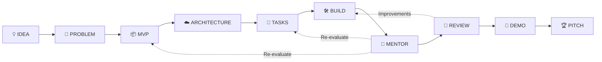

The agent continuously uses the current project state rather than treating each step as an isolated chatbot conversation.

---

# ✨ Features

| Stage                | What it does                                                                                                               |
| -------------------- | -------------------------------------------------------------------------------------------------------------------------- |
| 💡 **Idea Analyzer** | Problem, users, risks, assumptions, complexity, and a 5-dimension score (0–100). Challenges over-scoped ideas.             |
| 🎯 **MVP Generator** | Must / Nice / Future split, effort estimates, dependencies, **Reduce Scope** to the smallest useful MVP.                   |
| ☁️ **AWS Architect** | Per-service purpose, why, alternative, and tradeoff. Generates an architecture/data-flow diagram. Only warranted services. |
| 🛠️ **Task Board**   | Ordered tasks with priority, estimate, dependencies, status (TODO / IN PROGRESS / DONE), and automatic progress.           |
| 🤝 **AI Mentor**     | Observe → Analyze → Decide → Recommend. Uses project state and pushes back on scope creep.                                 |
| 📊 **Dashboard**     | Live progress, stage checklist, blockers, time remaining, AI score, and next best action.                                  |
| 🧪 **Review**        | Scores functionality, architecture, security, scalability, UX, innovation, and documentation + top 5 improvements.         |
| 🎤 **Demo & Pitch**  | 30s pitch, 60s demo script, 3-min deck, judge Q&A, and final pitch flow — all from real project data.                      |

A built-in **CampusConnect** sample project seeds the entire workflow with one click using **Try Demo Project**.

---

# 🖥️ Screenshots

Capture these for the showcase. The UI is designed for clean screenshots.

Recommended screenshots:

* Landing page with the journey strip
* Idea Analyzer with score cards and the AI's honest take
* MVP Generator with Must/Nice/Future columns
* AWS Architect with the data-flow diagram and service decisions
* Task board with progress bar
* Mentor pushing back on scope creep
* Review score cards
* Demo/pitch output

> Add image files under `docs/screenshots/` and link them here. You can capture them directly from the live app:
> https://d1opvm735eapyv.cloudfront.net

Example:

```markdown


```

---

# 🏗️ Architecture

## Overall AWS Architecture

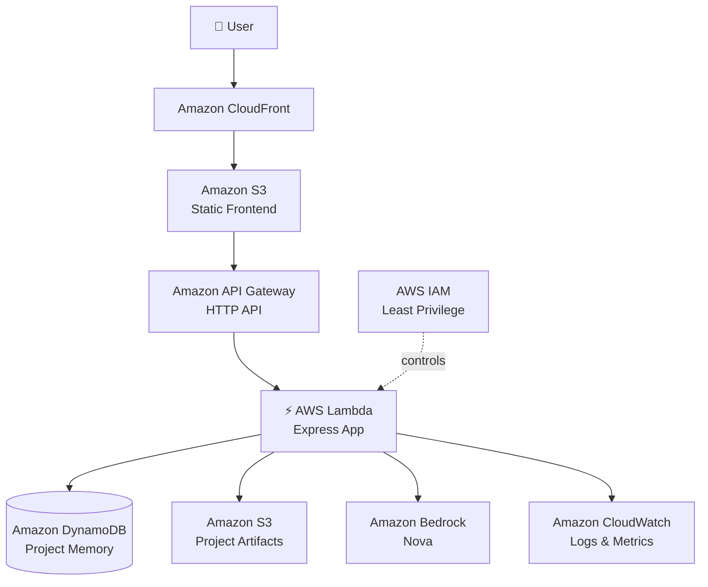

### Architecture Flow

1. The user interacts with the web application.
2. The frontend is hosted on Amazon S3.
3. Amazon CloudFront provides CDN delivery and HTTPS.
4. Frontend API requests are sent through API Gateway.
5. API Gateway invokes the Express application running on AWS Lambda.
6. Lambda reads and writes project state in DynamoDB.
7. Lambda can use Amazon Bedrock/Nova for AI enrichment.
8. Project artifacts can be stored in S3.
9. Logs and metrics are sent to CloudWatch.
10. IAM restricts Lambda to the required AWS resources.

The **same Express app** runs locally (`src/server.js`) and in Lambda (`src/lambda.js`), so behavior is identical in development and production.

---

# ☁️ AWS Services Used

| Service                           | Role                                                                                         |
| --------------------------------- | -------------------------------------------------------------------------------------------- |
| **Amazon Bedrock / Nova**         | AI reasoning: enriches idea analysis, mentoring, and pitch narrative.                        |
| **AWS Lambda**                    | Stateless backend logic and orchestration for every API route.                               |
| **Amazon API Gateway (HTTP API)** | HTTPS API layer between frontend and backend.                                                |
| **Amazon DynamoDB**               | Project memory — persists idea, MVP, architecture, tasks, decisions, reviews, and demo data. |
| **Amazon S3**                     | Static frontend hosting and project artifacts.                                               |
| **Amazon CloudFront**             | CDN + HTTPS for the frontend.                                                                |
| **Amazon CloudWatch**             | Structured JSON logs, metrics, and troubleshooting.                                          |
| **AWS IAM**                       | Least-privilege execution role for the required DynamoDB table and Bedrock model.            |

---

# 🧰 Technology Stack

* **Frontend:** React 18, React Router, Vite
* **Styling:** Custom CSS design system
* **Responsive:** Desktop / tablet / mobile
* **Backend:** Node.js 20 (ESM), Express
* **AI:** Amazon Bedrock (Nova)
* **AI fallback:** Deterministic reasoning engine
* **Persistence:** Amazon DynamoDB
* **Local persistence:** JSON file fallback
* **Infrastructure:** CloudFormation
* **Cloud:** AWS
* **Testing:** Node's built-in test runner (`node:test`)

The deterministic reasoning engine provides a reliable fallback so the application can work without live AWS Bedrock access.

---

# 🤖 Agent Workflow

Hackathon Copilot follows a real agent loop.

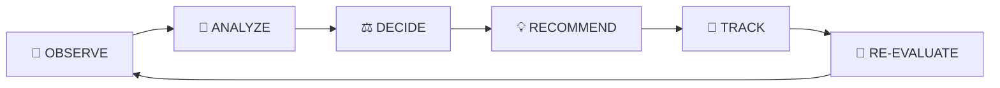

Every recommendation considers the current project state.

Because state is persisted in DynamoDB, later AI responses reflect earlier decisions.

The mentor therefore does not forget previous scope choices, and its advice changes as the project progresses.

### Example

> **You:** "I want to add 10 more features."
>
> **Mentor:** "You have ~25h of planned work left and the MVP is 55% done. Do NOT add features. Finish the core loop first."

---

# 🧠 AI Mentor Decision Flow

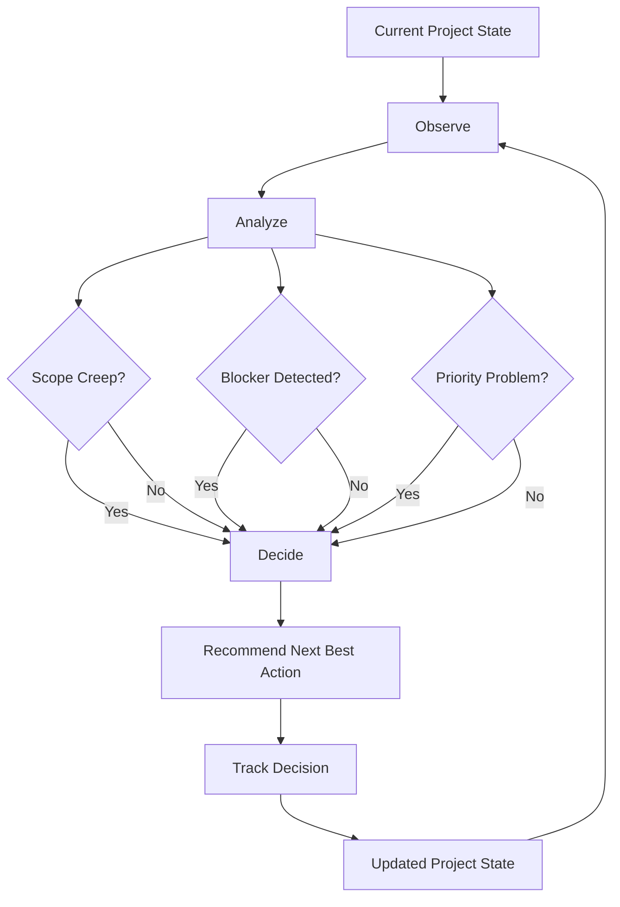

The mentor uses:

* Current MVP
* Remaining tasks
* Task progress
* Available time
* Previous decisions
* Project review state

This makes the mentor contextual rather than simply generating generic advice.

---

# 🔄 End-to-End Workflow

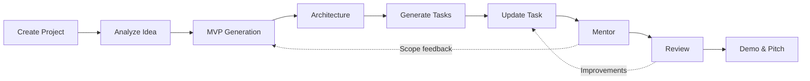

The automated test suite validates this complete workflow.

---

# 🗃️ DynamoDB Data Model

Hackathon Copilot uses a single DynamoDB table.

The partition key is:

```text
id
```

Each project is stored as one item.

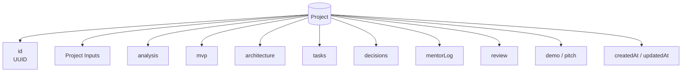

| Attribute                                            | Type        | Notes                                   |
| ---------------------------------------------------- | ----------- | --------------------------------------- |
| `id`                                                 | String (PK) | UUID                                    |
| `name`, `problem`, `targetUsers`, `availableTime`, … | String      | Project inputs                          |
| `analysis`                                           | Map         | Idea analysis + 5-dimension score       |
| `mvp`                                                | Map         | Must / Nice / Future features + summary |
| `architecture`                                       | Map         | Services + diagram                      |
| `tasks`                                              | List        | Ordered tasks with status               |
| `decisions`                                          | List        | Project decision log / memory           |
| `mentorLog`                                          | List        | Mentor interactions                     |
| `review`                                             | Map         | Review scores + improvements            |
| `demo`, `pitch`                                      | Map         | Generated demo/pitch content            |
| `createdAt`, `updatedAt`                             | String      | ISO timestamps                          |

### Access Pattern

Access patterns are intentionally simple:

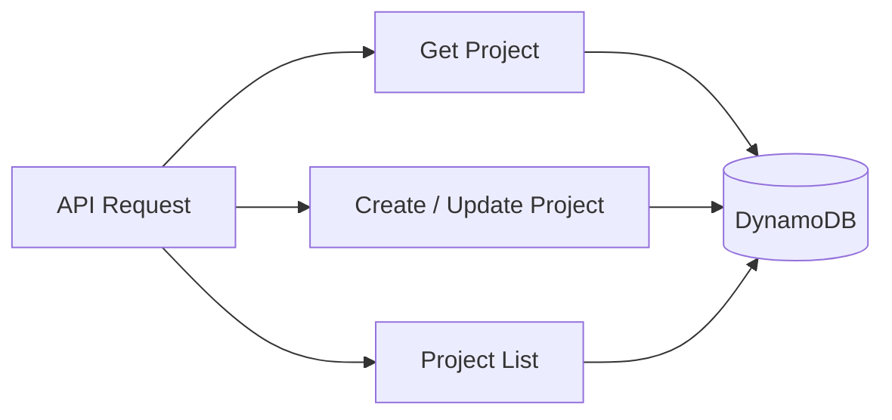

The application primarily uses key-value `get`/`put` operations plus a scan for the project list, which is appropriate for hackathon-scale usage with DynamoDB on-demand billing.

---

# 🧩 Local vs AWS Architecture

Hackathon Copilot supports both offline development and live AWS services.

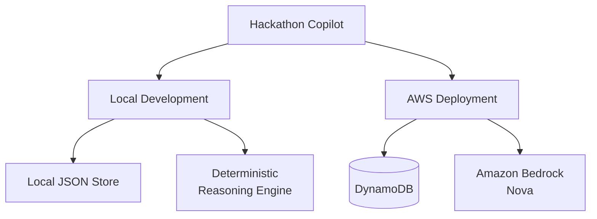

### Local Development

* Local JSON file store
* Deterministic reasoning engine
* No AWS account required
* No Bedrock access required

### AWS Deployment

* DynamoDB for persistent project state
* Amazon Bedrock/Nova for AI narrative enrichment
* Lambda for backend execution
* API Gateway for API access
* S3 + CloudFront for frontend hosting

---

# 🚀 Local Setup

## Prerequisites

* Node.js 18+
* Tested on Node.js 22

---

## 1. Install Dependencies

From the project root:

```powershell
npm run install:all
```

---

## 2. Configure Backend Environment

Optional:

```powershell
copy backend\.env.example backend\.env
```

For a fully offline run:

```text
BEDROCK_ENABLED=false
```

Leave:

```text
DYNAMODB_TABLE
```

empty.

---

## 3. Run the Backend

Open terminal 1:

```powershell
npm run dev:backend
```

Backend:

```text
http://localhost:4000
```

---

## 4. Run the Frontend

Open terminal 2:

```powershell
npm run dev:frontend
```

Frontend:

```text
http://localhost:5173
```

The frontend proxies:

```text
/api → http://localhost:4000
```

---

## 5. Open the Application

Open:

```text
http://localhost:5173
```

Then choose:

**Try Demo Project**

to load the CampusConnect sample project.

Or choose:

**Start Building**

to create your own project.

> With no AWS setup, the application uses the local JSON file store at `backend/.data/projects.json` and the deterministic reasoning engine. Everything works end-to-end.

---

# 🧠 Enabling Real AWS Bedrock Locally

To enable Amazon Bedrock/Nova:

### 1. Configure AWS credentials

```powershell
aws configure
```

Or configure AWS credentials using environment variables.

### 2. Request Nova model access

Request access to the Nova model in the Amazon Bedrock console in:

```text
us-east-1
```

### 3. Configure the backend

In:

```text
backend/.env
```

set:

```text
BEDROCK_ENABLED=true
BEDROCK_MODEL_ID=amazon.nova-lite-v1:0
```

### 4. Restart the backend

Narrative fields will now be enriched by Nova.

Structured data continues to come from the deterministic reasoning engine.

---

# 🗄️ Enabling DynamoDB Locally

Set:

```text
DYNAMODB_TABLE=<your-table>
```

and configure valid AWS credentials.

The table requires a String partition key named:

```text
id
```

---

# ☁️ AWS Deployment

> **Status: Already deployed and live**
>
> Public application:
> https://d1opvm735eapyv.cloudfront.net
>
> CloudFormation stack:
> `hackathon-copilot`
>
> Region:
> `us-east-1`

The infrastructure is defined in:

```text
infra/template.yaml
```

It includes:

* AWS Lambda
* HTTP API
* DynamoDB
* S3
* CloudFront
* IAM
* CloudWatch

---

# 🛠️ Deployment Architecture

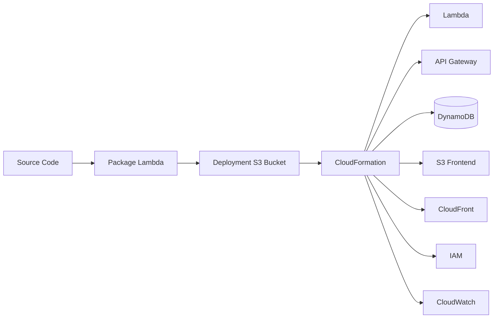

---

# Prerequisites

* AWS CLI configured with credentials
* Amazon Bedrock model access for Nova enabled in the target region

---

# Option A — AWS CLI + CloudFormation

No SAM CLI required.

This is the deployment approach used for the live stack.

### 1. Package the Backend

```powershell
$build = ".build\lambda"
Remove-Item -Recurse -Force $build -ErrorAction SilentlyContinue
New-Item -ItemType Directory -Path $build -Force | Out-Null
Copy-Item -Recurse backend\src "$build\src"
Copy-Item backend\package.json "$build\package.json"
npm --prefix $build install --omit=dev --no-audit --no-fund
```

### 2. Create Deployment Bucket

```powershell
$acct = aws sts get-caller-identity --query Account --output text
$bucket = "hackathon-copilot-deploy-$acct-us-east-1"

aws s3 mb "s3://$bucket" --region us-east-1
```

### 3. Package the CloudFormation Template

```powershell
aws cloudformation package --template-file infra/template.yaml `
  --s3-bucket $bucket --s3-prefix lambda `
  --output-template-file .build/packaged.yaml --region us-east-1
```

### 4. Deploy the Stack

```powershell
aws cloudformation deploy --template-file .build/packaged.yaml `
  --stack-name hackathon-copilot --capabilities CAPABILITY_IAM --region us-east-1
```

### 5. Read the Deployment Outputs

```powershell
aws cloudformation describe-stacks --stack-name hackathon-copilot `
  --region us-east-1 --query "Stacks[0].Outputs" --output table
```

---

# Option B — AWS SAM CLI

If AWS SAM CLI is installed:

```powershell
sam build -t infra/template.yaml
sam deploy --guided --stack-name hackathon-copilot
```

---

# 🌐 Deploy the Frontend to S3 + CloudFront

### 1. Point the frontend to the deployed API

```powershell
$env:VITE_API_BASE = "<ApiUrl output>/api"
```

### 2. Build the frontend

```powershell
npm run build
```

### 3. Upload to S3

```powershell
aws s3 sync frontend/dist "s3://<FrontendBucketName output>" --delete --region us-east-1
```

### 4. Invalidate CloudFront

```powershell
aws cloudfront create-invalidation --distribution-id <DIST_ID> --paths "/*"
```

Open the **FrontendUrl** CloudFormation output to access the public application.

---

# 📡 Live Deployment Outputs

| Output               | Value                                                  |
| -------------------- | ------------------------------------------------------ |
| `FrontendUrl`        | https://d1opvm735eapyv.cloudfront.net                  |
| `ApiUrl`             | https://a8m93724d5.execute-api.us-east-1.amazonaws.com |
| `ProjectsTableName`  | `hackathon-copilot-ProjectsTable-1HWFXB2DRG1E1`        |
| `FrontendBucketName` | `hackathon-copilot-frontendbucket-psgziurebn0c`        |

---

# 🔐 Environment Variables

| Variable           | Where            | Purpose                                                |
| ------------------ | ---------------- | ------------------------------------------------------ |
| `PORT`             | Backend          | Local port, default `4000`                             |
| `CORS_ORIGIN`      | Backend / Lambda | Allowed origin; set to CloudFront domain in production |
| `BEDROCK_ENABLED`  | Backend / Lambda | `false` to force offline engine                        |
| `BEDROCK_MODEL_ID` | Backend / Lambda | Example: `amazon.nova-lite-v1:0`                       |
| `AWS_REGION`       | Backend / Lambda | Bedrock/DynamoDB region                                |
| `DYNAMODB_TABLE`   | Backend / Lambda | Table name; empty = local file store                   |
| `VITE_API_BASE`    | Frontend build   | Production API base URL                                |

---

# 🔒 Security & IAM

Hackathon Copilot follows a least-privilege approach.

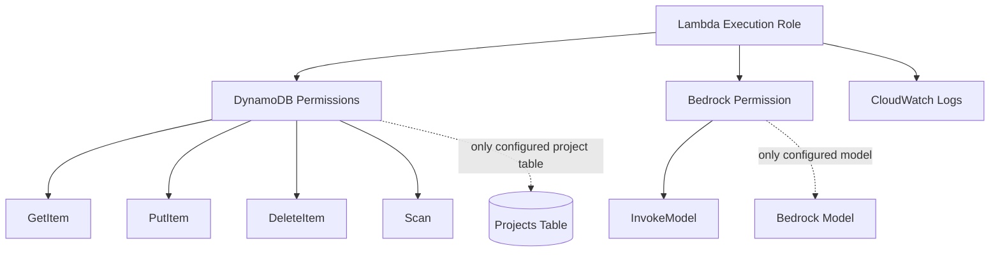

The Lambda execution role grants only:

* `dynamodb:GetItem`
* `dynamodb:PutItem`
* `dynamodb:DeleteItem`
* `dynamodb:Scan`

on the single project table.

It also grants:

* `bedrock:InvokeModel`

on the configured model ARN.

CloudWatch Logs permissions are provided through the managed basic execution role.

> **No AWS credentials ever live in the frontend.**

---

# 🧪 Testing

Run the complete test suite with:

```powershell
npm test
```

The project uses Node's built-in test runner:

```text
node:test
```

---

# 🔬 Test Coverage

The test suite covers:

* Project creation
* Idea analysis
* MVP generation
* Reduce Scope
* Architecture generation
* Task generation
* Task updates
* DynamoDB/local persistence
* AI mentor scope-creep detection
* Project review
* Demo generation
* API error handling
* Full end-to-end workflow

### End-to-End Test

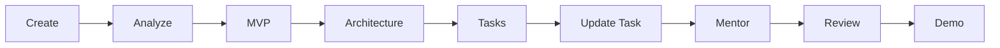

All tests run offline with:

```text
Bedrock disabled
Temporary local store
```

This keeps the test suite hermetic and fast.

---

# 📊 Observability

The backend emits **structured JSON logs** from:

```text
backend/src/lib/logger.js
```

Logs cover:

* API requests
* Workflow steps
* AI success/fallback
* Store operations
* Troubleshooting information

In AWS Lambda, these logs flow into:

**Amazon CloudWatch Logs**

and can be queried using:

**CloudWatch Logs Insights**

Sensitive keys are automatically redacted, including:

* password
* token
* secret
* credentials

Request bodies are never logged.

---

# 🔎 Example CloudWatch Logs Insights Query

```text
fields @timestamp, event, id
| filter event like /workflow/
| sort @timestamp desc
```

---

# 🎤 Demo Instructions

## 60–90 Second Demo

### 1. Start

Open:

https://d1opvm735eapyv.cloudfront.net

Click:

**Try Demo Project**

This seeds the CampusConnect project.

### 2. Idea

Show:

* Idea score
* AI analysis
* AI challenging weak scope

### 3. MVP

Show:

* Must
* Nice
* Future

Then click:

**Reduce Scope**

### 4. Architecture

Show the generated AWS architecture/data-flow diagram.

### 5. Tasks

Show:

* Generated roadmap
* Priorities
* Dependencies
* Progress

### 6. Mentor

Ask:

> "Should I add a mobile app now?"

The mentor should push back and recommend finishing the core first.

### 7. Review

Show the review score cards.

### 8. Demo

Show:

* Generated pitch
* Demo script
* Presentation flow
* Judge Q&A

### 9. End With

> **"From idea to MVP with an AI teammate."**

---

# 🧑‍💻 Demo Journey

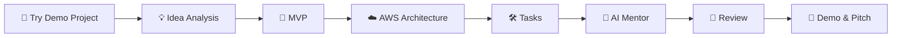

---

# ⚠️ Known Limitations

### 1. Single User

There is currently no authentication.

Projects are not scoped to individual accounts.

**Recommended next step:** Amazon Cognito for multi-user authentication.

### 2. Deterministic Structured Reasoning

The reasoning engine is rule-based.

Bedrock enriches narrative fields, while structured scoring remains deterministic.

This is intentional to provide reliability during demos.

### 3. DynamoDB Scan

The project list uses DynamoDB `Scan`.

This is suitable for hackathon-scale usage.

For larger datasets, a Global Secondary Index (GSI) would be more appropriate.

---

# 🔮 Future Improvements

Potential future improvements include:

* Amazon Cognito-based multi-user projects
* Streaming AI responses for faster perceived latency
* One-click export of the task plan into a real repository scaffold
* Richer rendered architecture diagrams
* More advanced AI reasoning
* Expanded project collaboration capabilities

---

# 🗺️ Future Architecture

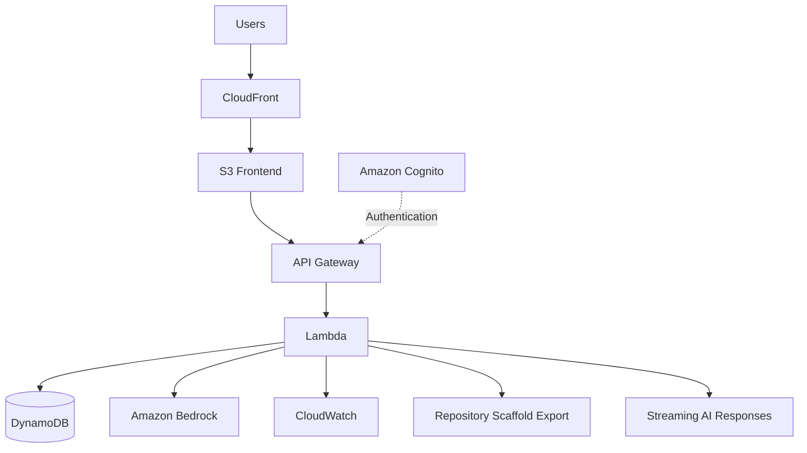

---

# 📁 Project Concept

Hackathon Copilot is designed around a simple principle:

> **The AI should not just answer questions. It should help the builder make better decisions and finish the project.**

Instead of treating AI as a standalone chatbot, Hackathon Copilot maintains project state and uses that state throughout the hackathon.

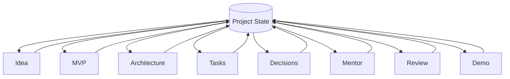

This shared state allows recommendations to evolve as the project evolves.

---

# 🏆 Why Hackathon Copilot?

Hackathons are not only about building features.

Builders also need to decide:

* What should we build?
* What should we remove?
* Which AWS services do we actually need?
* What should we build first?
* Are we running out of time?
* Are we experiencing scope creep?
* Is the architecture appropriate?
* Is the project secure?
* What should we demonstrate?
* How should we explain the project to judges?

Hackathon Copilot brings those decisions into one continuous workflow.

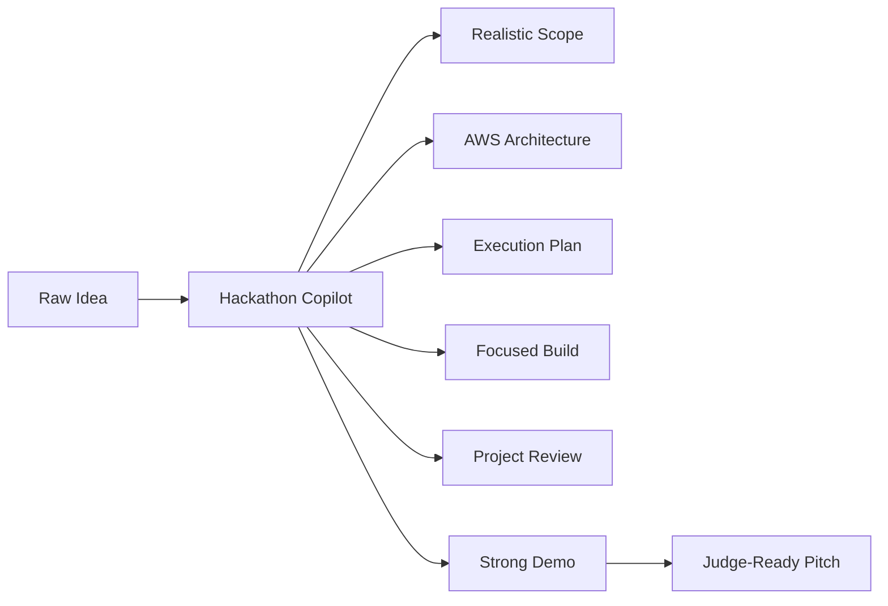

---

# 📋 Submission Checklist

See:

```text
docs/showcase.md
```

for the full showcase article material and final submission checklist.

---

# 📜 License
This project is licensed under the MIT License.

MIT License

Copyright (c) 2026 Hackathon Copilot

Permission is hereby granted, free of charge, to any person obtaining a copy
of this software and associated documentation files (the "Software"), to deal
in the Software without restriction, including without limitation the rights
to use, copy, modify, merge, publish, distribute, sublicense, and/or sell
copies of the Software, and to permit persons to whom the Software is
furnished to do so, subject to the following conditions:

The above copyright notice and this permission notice shall be included in all
copies or substantial portions of the Software.

THE SOFTWARE IS PROVIDED "AS IS", WITHOUT WARRANTY OF ANY KIND, EXPRESS OR
IMPLIED, INCLUDING BUT NOT LIMITED TO THE WARRANTIES OF MERCHANTABILITY,
FITNESS FOR A PARTICULAR PURPOSE AND NONINFRINGEMENT. IN NO EVENT SHALL THE
AUTHORS OR COPYRIGHT HOLDERS BE LIABLE FOR ANY CLAIM, DAMAGES OR OTHER
LIABILITY, WHETHER IN AN ACTION OF CONTRACT, TORT OR OTHERWISE, ARISING FROM,
OUT OF OR IN CONNECTION WITH THE SOFTWARE OR THE USE OR OTHER DEALINGS IN THE
SOFTWARE.
